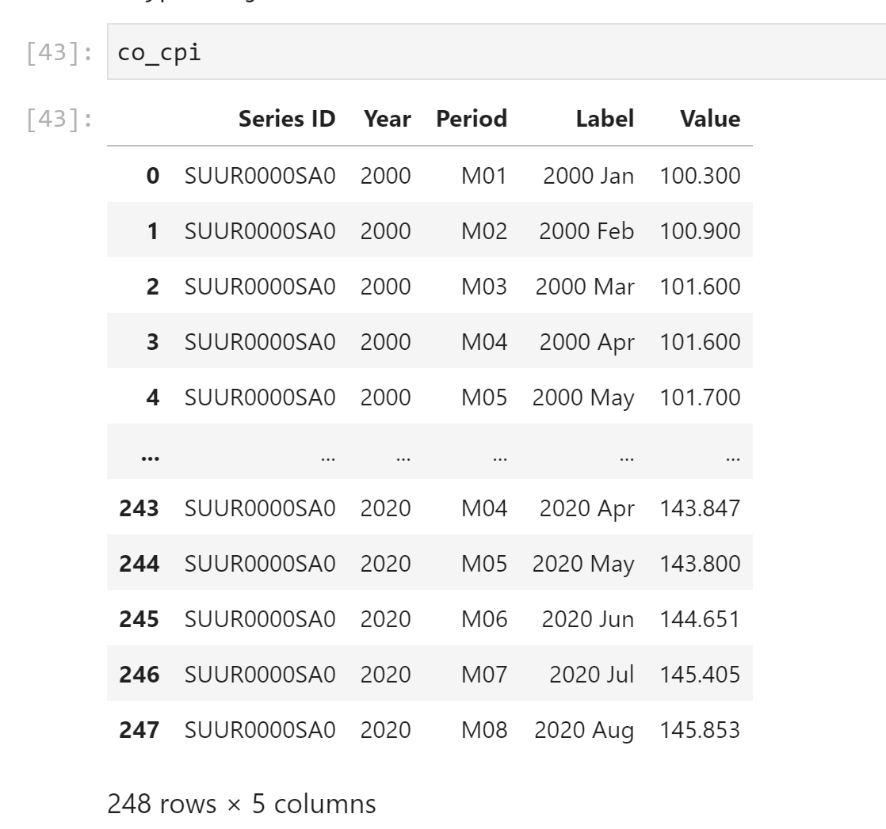
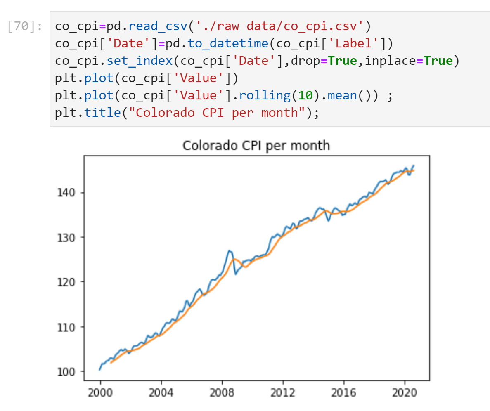
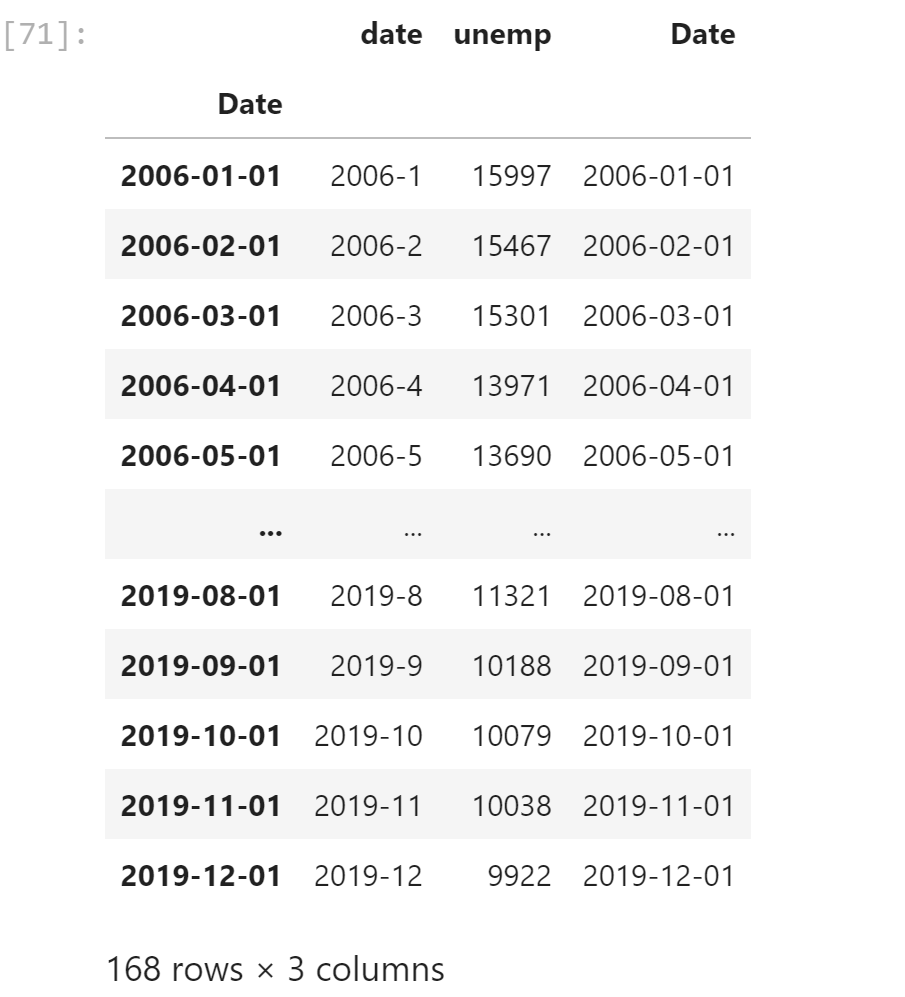
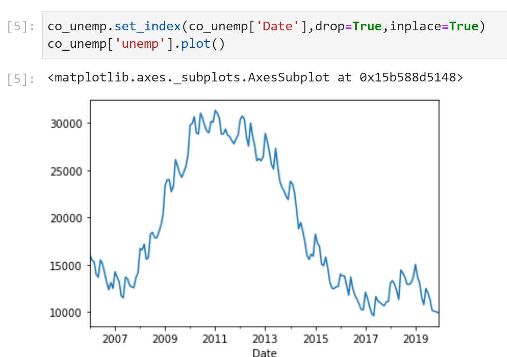
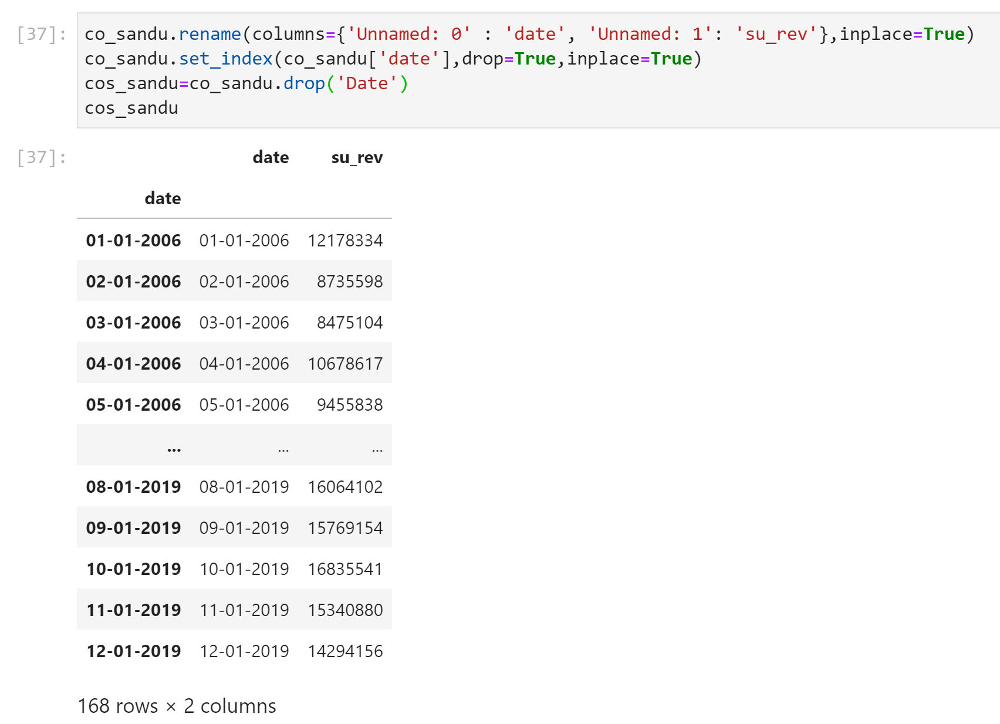
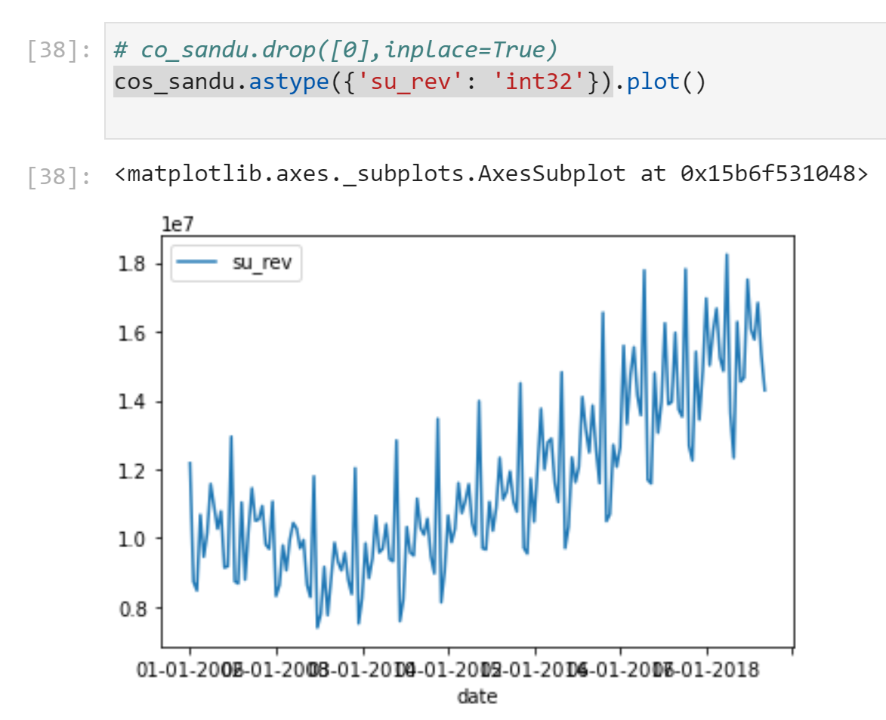
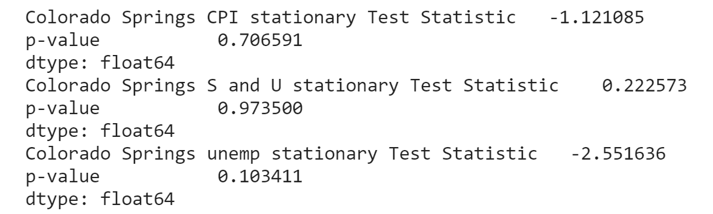

## Capstone Check in #2
----

All three proposals were good proposals. Of the three I chose the first: Quantitative risk score for entrepreneurs. 

## Problem statement

Entrepreneurs have the daunting task of simply getting a business up and running. This reqires a fair amount of passion and hutzzpah and sometimes emotions get high and cloud the judgement of when to get into a market. The first vehicle was not made by Henry Ford, and the first steam ship was not made by Vanderbuilt, yet we know their names because they waited for the right timing to release their product. This project provides a signal to entrepreneurs about when to enter into a certain industry within their local market based on historical data. 

## Revised Goals

Original idea was to use a qualitative score that will give entrepreneurs a risk score of when to enter into any given market. The spirit of the idea remiains, but the process has changed. Instead of a qualitative score, I've changed to a model that is related to a stock market indicator called a stochastic oscillator. 

Success is measured when a client enters their desired industry and location, and receives a risk score between 1-10 (1 being low risk and 10 being high ) that will contribute to their decision making process and hopefully prevent unseen hardships. 

## Proposed Methods and Models

Use ARIMA timeseries modeling to create a multivariate timeline and pass it into a stochastic oscilator to determine when to enter or exit the private business industry in colorado springs. 

The ARIMA model will provide a measure of local economy health. The Stochasitic oscilator provides the benchmarks or indicators of a healthy or unhealthy economy. 

Why Stochasitc Oscillators?

Stochastic oscillators help stock traders know when to buy or sell a particular stock based on historical market signals. They have been incredibly accurate as a tool for traders. 

Why are we using them? Stochastic Oscillators do not predict what tomorrow's stock price will be, only the probabability of the direction a stock market may take based on historical trading volume. Historically this method is more accurate than random chance. This follows the same basic fundementals as the economy as far as predictability. No one has one magic algorithm to predict what the economy will do tomorrow, but we can look at signals like unemployment, monetary metrics like tax revenue, and consumer price index. 

Why an ARIMA model? 

We are assuming that not one single variable like gdp is enough to accurately measure an economy. Instead we use unemployment, sales tax revenue, and the consumer price index. unemployment for obvious reasons, tax revenue because it is an accurate and meaurable metric for consumer spending, and consumer price index because as tax revenue and cpi are measured together, if revenue and cpi diverge, then the local economy cannot support inflation and is indicative of a depressed economy. All three combined will determine a better overall picture of an economy. 

Instead of stock market prices as an indicator, we use a ARIMA timeseries model to mimick a stock market time series data. The ARIMA model is a twist on stock prices since we are combinning consumer price index, revenue and use tax revenue, and unemployment to create a multi-variate timeseries model. This will have an added benefit of cross validating our data with projections.  

## Preliminary EDA

Colorado Springs CPI per month

        

Colorado Springs Unemployment per month

         

Colorado Sales and Use Tax revenue

           

Summary p values 

  

## Problems and Obstacles. 

I can't find monthly data for GDP which is why I chose to go with sales and use tax revenue. I am waiting to hear back from resources at the economic department at the local university to see if this information is accessible. The closest I could get was quarterly GDP for the state of Colorado. 

There needs to be more refinement of the data to make it work with the stochastic ocsilator. I need to write a piece of code that lists the highest and lowest points of the data within a pre determined period most likely 14 month period.

Next steps is to stabalize the data and get the p-value to an acceptible level. 

The next large obstacle is whether I will be able to automate and insert new data with API's into a web based application.

## Source:
**Data** - U.S. Bureau of Labor Statistics. https://www.bls.gov/regions/mountain-plains/co_coloradosprings_msa.htm

**Data** - https://coloradosprings.gov/sales-tax/page/sales-tax-information

**Data** - U.S. Bureau of economic analysis. https://apps.bea.gov/itable/iTable.cfm?ReqID=70&step=1#reqid=70&step=1&isuri=1

**Code Resource** - Abhay Katiryar https://github.com/Abhay64/Stochastic-Oscillator

Citations

 

    
-CPI and the effects from recessions
    
https://pocketsense.com/recessions-effects-cpi-8135118.html   
    
-Primer on Stochastic Oscillators  https://www.investopedia.com/articles/technical/073001.asp#:~:text=key%20takeaways,a%20high%20degree%20of%20accuracy.&text=it%20can%20be%20beneficial%20to,strength%20index%20(RSI)%20together.

